# Monoculor Visual Odometry
## Introduction:  
Visual odometry(VO) is the process of determining the position and orientation of a robot by analyzing the associated camera images. The project is designed to estimate the motion of calibrated camera mounted over a mobile platform. Motion is estimated by computing the feature points of the image and determining the relative translation and rotation of the images.
## Visual odometry pipeline: 
1 Image sequences  
2 Feature Detection  
3 Feature Matching (or Tracking)  
4 Motion Estimation (2-D-to-2-D 3-D-to-3-D 3-D-to-2-D)  

## Different Algorithms For Visual Odometry Pipeline used in the project: 
* 3D-2D Motion estimation using Optical Flow method.   
* 2D-2D Motion Estimation using Feature matching method.  
* 2D-2D Motion Estimation using Optical Flow Method. 
## Algorithms:  
### 2D-2D Motion Estimation(Feature matching):  
1) First image(I1) and Second image(I2) was Captured and Features were computed in both images using sift Feature Detector.  
2) Corresponding features were matched using FlannBasedMatcher and accuracy was maintained using ratio test.    
3) Using matched features essential matrix for image pair I1, I2 was computed.
4) Decompose an essential matrix into a rotation matrix and a translation matrix.  
5) 3D Point cloud was computed by triangulating the image pair.
6) Repeat the process and compute point cloud for the next corresponding image pair.  
7) Relative scale was computed by taking the mean of distances between the consecutive points clouds obtained from keypoint matching of subsequent images and rescale translation accordingly.  
8) Concatenate transformation and repeat the process.  
Reference code : [2D-2D Feature Matching](https://github.com/pareespathak/visual_odometry/blob/main/codes/2d-2d_feature_matching.py) 
### 2D-2D Motion Estimation(Feature tracking):  
1) First image(I1) and Second image(I2) was Captured and Features were computed in the First image using the shi-Tomasi corner detector.  
2) Features of I1 were tracked in I2 using Lucas Kanade optical flow method.  
3) Calculate tracked features calculate essential, rotation matrix, translation matrix, and relative scale between images as explained above.  
4) Track features in the next frames and concatenates transformation.  
5) Update the reference frame when a sufficient number of features were not tracked and repeat the process.  
Reference code : [2D-2D Feature Matching](https://github.com/pareespathak/visual_odometry/blob/main/codes/2d-2d_feature_tracking_homo.py) 
### 3D-2D Motion Estimation:  
* Do only once:  
   1) Capture two frames I1, I2 and extract feature from first image(I1)  
   2) Track features of I1 in I2 using Lucas Kanade optical flow method. 
   3) Compute essential matrix and triangulate features from I2, I1 to get point 3D cloud.  
   
* Do at each iteration:
   1) Capture a new frame.  
   2) Track features of the previous frame in the new frame using Lucas Kanade optical flow method.  
   3) Compute camera pose using Perspective-n-Point algorithm(PnP) from 3-D(point cloud)-to-2-D(corresponding tracked features).
   4) Concatenate transformation.
   4) Triangulate all-new feature matches between the two frames and obtain point cloud.
   5) Iterate the process.  
   6) Update reference frame when a sufficient number of features were not tracked, and repeat the process.  
 * Reference code : [3D-2D implementation](https://github.com/pareespathak/visual_odometry/blob/main/codes/3d_2d_optical_flow.py) 

### Literature:  
visual odometry pipeline : [Scaramuzza paper](https://www.ifi.uzh.ch/dam/jcr:5759a719-55db-4930-8051-4cc534f812b1/VO_Part_I_Scaramuzza.pdf)

## Results 2D-2D:  
KITTI sample dataset (Feature Matching) 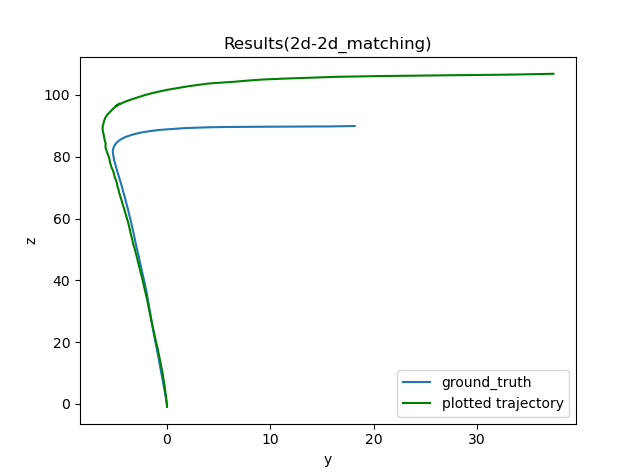 | KITTI 05 dataset (Matching)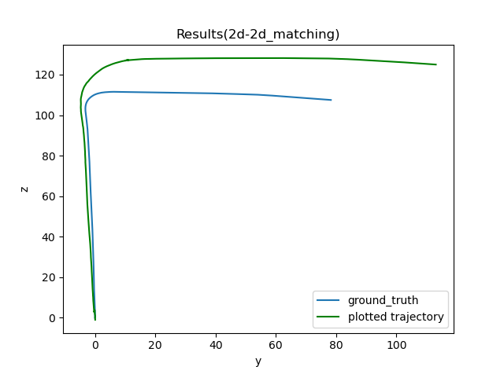 | Video trajectory (Matching)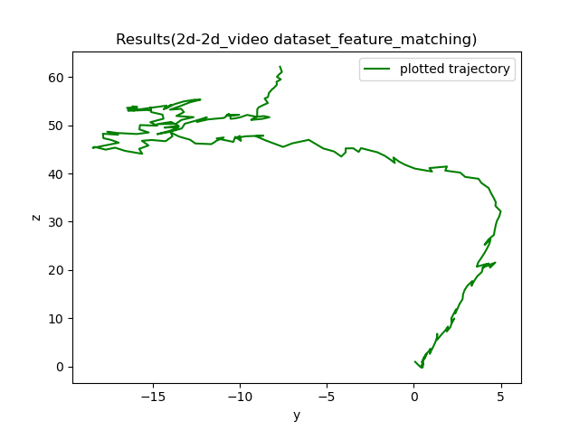 
--------------------------------------------------------|----------------------------------|------------------
KITTI sample dataset (Feature Tracking) 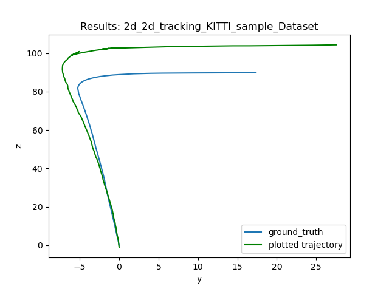  |  KITTI 05 dataset (Tracking)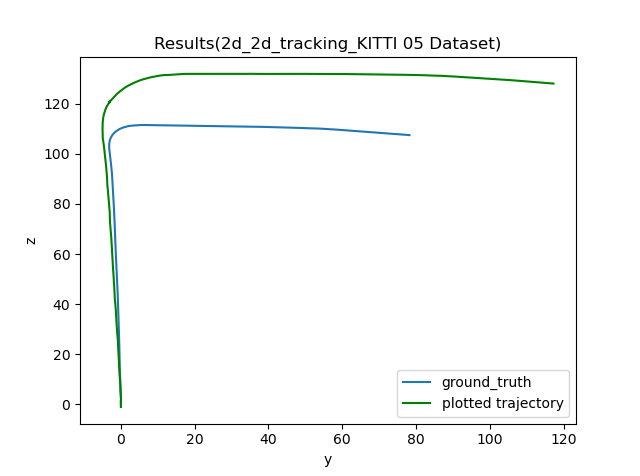 | Video trajectory (Tracking)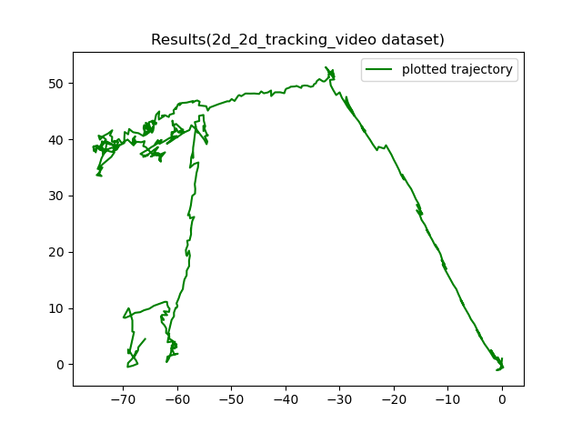

## Results 3D-2D with Reprojection error plots : 
KITTI sample dataset 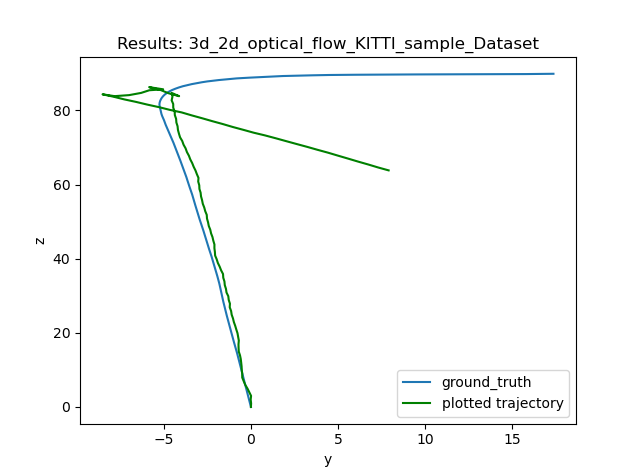 | KITTI 05 dataset 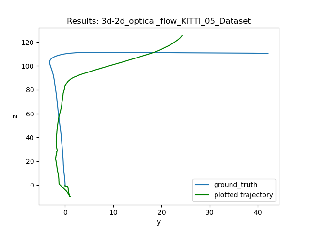
--------------------------------------------------------|----------------------------------
Reprojection error 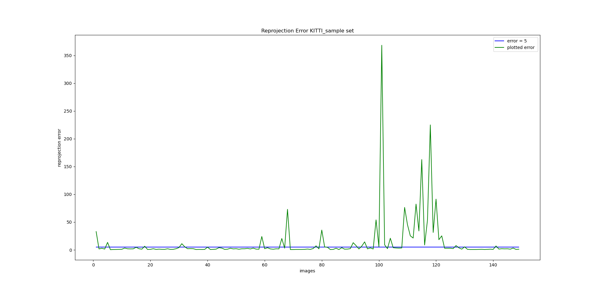 |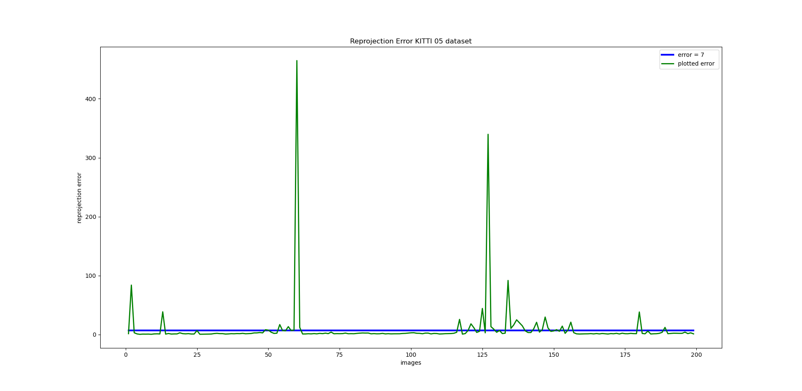    
Video trajectory 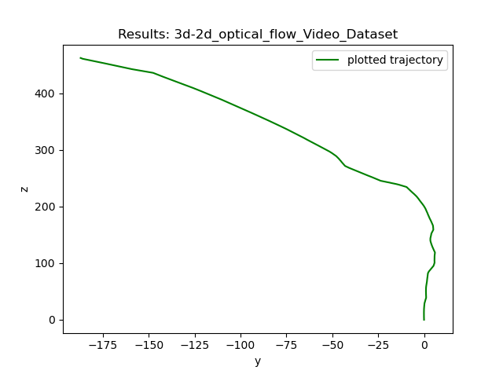 | 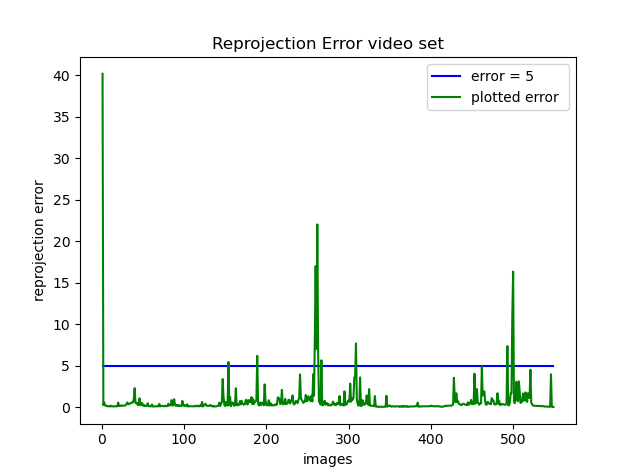

